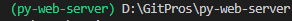

# py-web-server

## 前言

### 文件结构

venv 虚拟环境相关文件(不要上传)：

- Lib
- Include
- Scripts
- pyvenv.cfg

原码文件 src

### 虚拟环境的使用

在 py-web-server 目录打开命令行(推荐 powershell)

```powershell
# 命令行进入项目 py-web-server 的父目录
Set-Location py-web-server
Set-Location ..

# 创建虚拟环境
Set-Location py-web-server
python -m venv py-web-server 
# 激活虚拟环境
.\Scripts\activate
```



如图表示已经进入虚拟环境，此时使用 pip 将仅在本项目文件中起作用

```powershell
# 下载虚拟环境包列表中的包
pip install -r requirements.txt
```

下载新包后更新虚拟环境的包列表

```powershell
# 导出当前环境存在的包(上传前需要进行该步骤)
pip freeze > requirements.txt
```

退出虚拟环境

```powershell
deactivate
```

### 项目要求

二.	 Web服务器的设计和实现

1、项目目标

（1）	通过socket API接口，掌握http等协议，并设计和实现web服务器的核心功能。

（2）	使用web客户端，和自己编写实现的web服务器进行通讯，展示web服务器各核心功能是正常工作的。

2、项目要求：

（1）	功能上包含Web服务器的核心功能；

（2）	设计成多线程循环处理的模式。

注意： 

（1）	以上四个项目选择一个项目作为第四个实验。2—4人一组。

（2）	每个项目中详细分析核心功能的设计方法、过程和步骤，并给出核心功能实现代码

（3）	运行代码，并截图展示核心功能的运行结果。
