# python虚拟环境的构建

## 了解python虚拟环境

 [Virtual Environments and Packages (Python.org)](https://docs.python.org/3/tutorial/venv.html) and [Installing Python Modules (Python.org)](https://docs.python.org/3/installing/index.html#installing-index).有对虚拟环境内容和包管理的讲解，而我是通过[安装不算完事，只有理解了虚拟环境才算真正掌握 Python 环境_哔哩哔哩_bilibili](https://www.bilibili.com/video/BV1V7411n7CM)的视频开始了解虚拟环境的

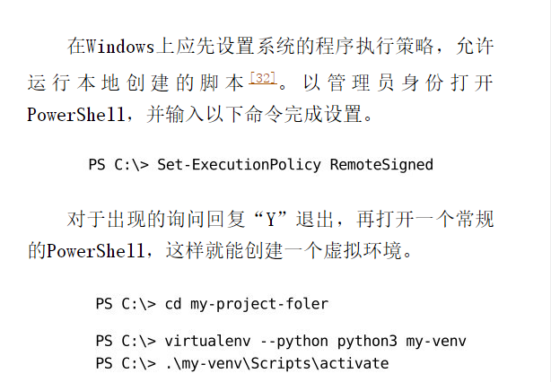


来自《Python编程之美：最佳实践指南》

[(78条消息) 【Windows】Windows PowerShell 无法允许脚本执行_DovSnier 专栏-CSDN博客_powershell 允许运行脚本](https://blog.csdn.net/DovSnier/article/details/105001344)

## conda,virtualenv,venv,pipenv——几种常用的虚拟环境构建工具

[(78条消息) 一文解读 virtualenv & venv & pipenv 之间的联系与区别_I'm George 的博客-CSDN博客_virtualenv和pipenv](https://blog.csdn.net/weixin_40922744/article/details/103721870)

- **conda**安装anacoda产生的命令
- **virtualenv**第三方虚拟环境工具，自python2开始，因此py2，py3应当都可使用
- **venv**自python3.3后，win版的python自带venv，仅支持这以及这之后的版本明显的特点是通过requirements.txt来管理包，用它来存储包列表也是一种打包方式
- **pipenv**集成了pip和virtualenv的功能，能存储依赖关系，将requirements.txt换成其他方式存储包及包依赖关系，但是现阶段存在一些不可回避的问题，比较好的替代建议有docker+pip

- **Poetry**最后还是提一下Poetry吧。Python的工作流工具，其实无非是解决三个方面的问题：虚拟环境管理、依赖管理、打包发布。Pipenv只包含前两项，比重是50%:50%，而Poetry同时包括三项，比重是20%:40%:40%。所以当我用惯了Pipenv切换到Poetry时会非常不习惯——它对于虚拟环境的控制太弱了：我无法知道我用的是哪个环境，路径是什么，也不能随心所欲地删除、清理、指定虚拟环境的位置。Pipenv的依赖解析器确实存在很多问题，但Poetry的也离完美有一段距离。而且Poetry负责的打包发布部分，也不是最好的。

  所以我认为Poetry也没有大家推荐的那么好。如果Pipenv没有满足你的要求，那么虚拟环境管理方面我推荐[virtualenvwrapper](https%3A//virtualenvwrapper.readthedocs.io/)（就是virtual的进一步封装版，使用shell脚本开发，不支持windows，但是有带有-win后缀的windows版）+[direnv](https%3A//www.baidu.com/link%3Furl%3DZLnHDmLvp9jeNCDgIzlPNZUbONmmIC5VaeqUuHAiHWG%26wd%3D%26eqid%3D8c60d2c7001f275e000000065d6b811e)（这两个的最大问题是不支持Windows)，依赖解析方面我推荐[piptools](https%3A//github.com/jazzband/pip-tools/)，打包发布还是用setuptools。

  来自[Pipenv有什么问题 - 知乎 (zhihu.com)](https://zhuanlan.zhihu.com/p/80695813)

（使用docker+pip其实就是抛开这四种python的虚拟环境构建工具，直接使用专门的虚拟环境工具例如docker和虚拟机，这些东西相当成熟，另外conda因为是商业发行，相当方便，而venv和virtual作为老工具，比较麻烦但是也比较可靠）

综合阅读[不要用 Pipenv - 知乎 (zhihu.com)](https://zhuanlan.zhihu.com/p/80478490)及文末推荐的文章，我决定先使用pip+venv的方式来操作虚拟环境，以后学习了docker之类的工具或者遇到环境打包分发需求，再考虑docker+pip的方案

## 使用pip+venv方式来管理虚拟环境

1. 构建环境

> 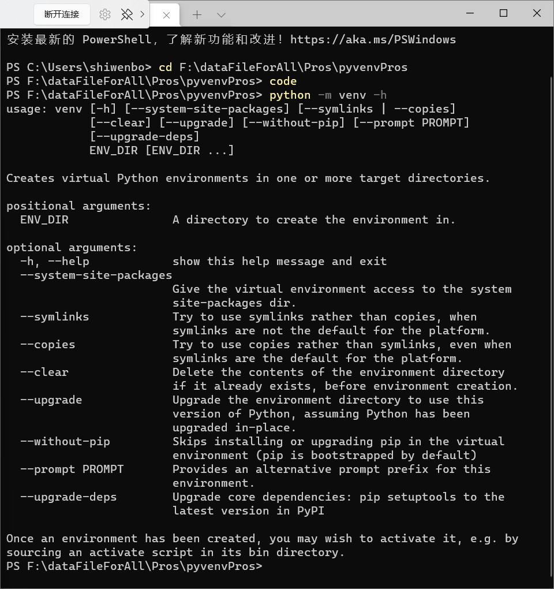
>
> - --system-site-packages表示将允许调用系统环境的包，而默认情况下不会
> - --withou-pip表示不为虚拟环境安装pip包
> - 看帮助最后一行的提示可知，虚拟环境有一些bat脚本或者ps1脚本需要运行，比如用activate激活虚拟环境，这就需要用到前面提到的设置windows的系统策略
>
> 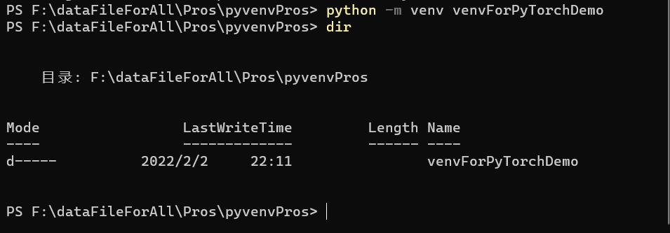
>
> 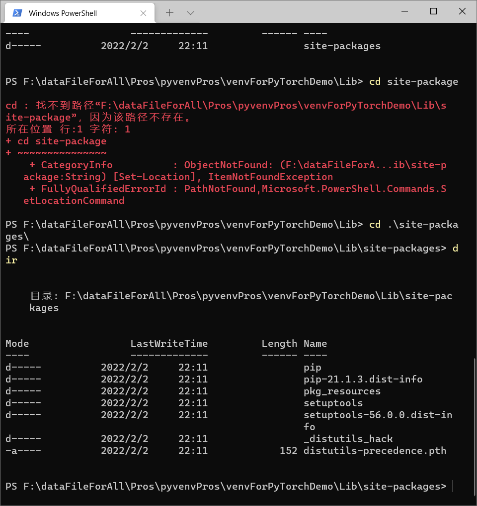
>
> 可以看到已经有了pip和setuptools包
>
> 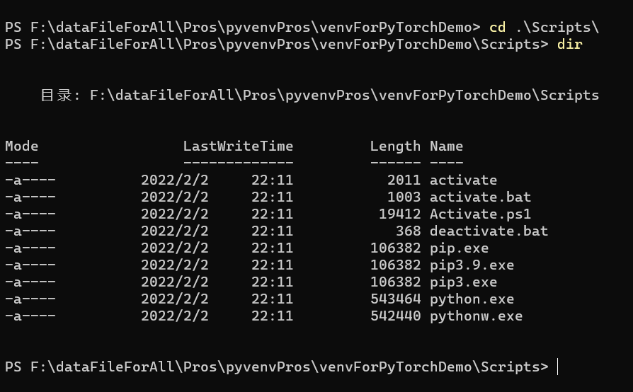
>
> 可以看到脚本中已经有了activate激活脚本等，使用虚拟环境前激活是个好习惯
>
> 
>
> 未调整系统策略导致的报错，如果使用cmd就不需要进行调整
>
> 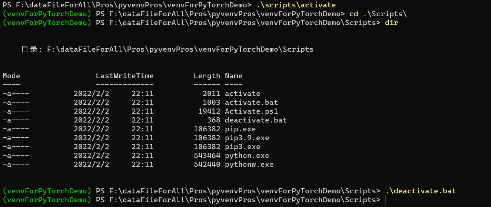
>
> 
>
> 使用scripts中自带的deactivate.bat脚本不能退出环境（当使用powershell时出现上述问题，如果使用命令提示符就没问题，原因以及解决方式见[issue 32910: venv: Deactivate.ps1 is not created when Activate.ps1 was used - Python tracker](https://bugs.python.org/issue32910)，deactivate不是现成的脚本，是执行activate.ps1后产生的全局函数）
>
> 虽说我查到一些blog称powershell兼容bat脚本文件，但是实测使用再powershell中使用.bat脚本激活会出现进入虚拟环境但是不显示上图绿色字符，而且退出时只能使用deactivate.bat脚本等不太良好的使用体验，因此在powershell中还是建议输入activate.ps1或者activate执行脚本激活虚拟环境，输入deactive退出虚拟环境。
>
> *注意，在powershell中不可用deactivate.bat退出环境*
>
> 正确的激活和退出方式如下：
>
> 
>
> 或者
>
> 
>
> 虚拟环境中更新pip要注意：
>
> 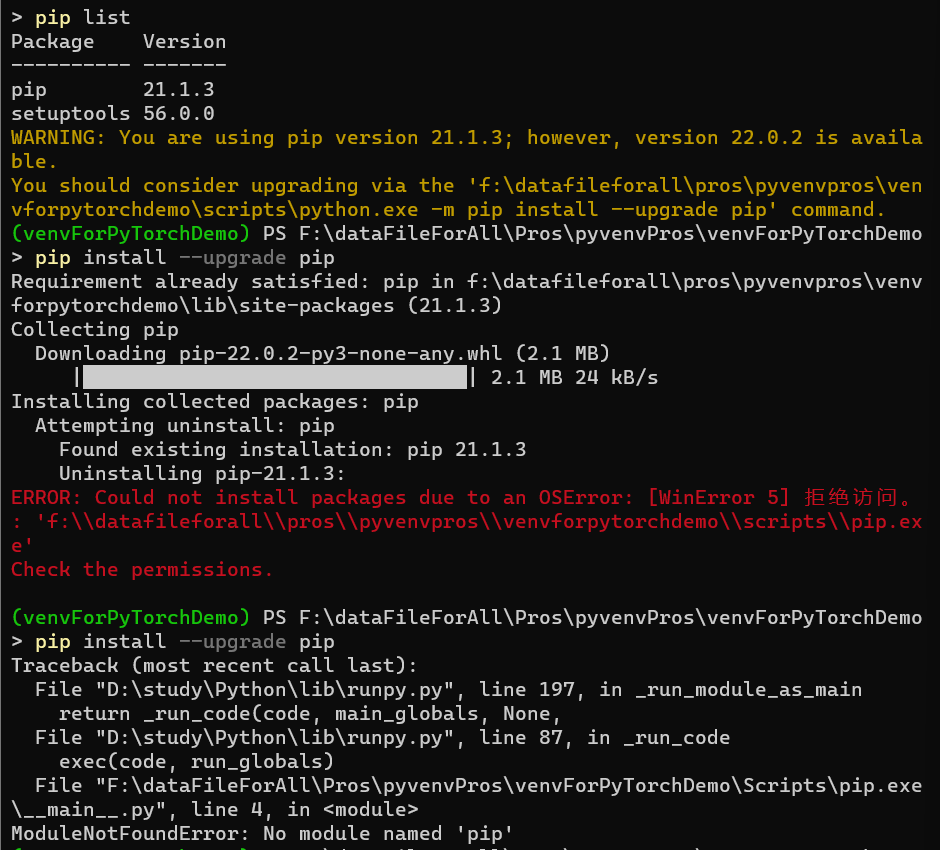
>
> 解决方法：
>
> [(78条消息) venv虚拟环境中的pip更新失败问题_景韦的专栏-CSDN博客_venv更新pip](https://blog.csdn.net/jewely/article/details/104573764)
>
> 当出现包安装错误导致中断后（上面那种情况就是），使用pip list可能出现这种黄字，
>
> 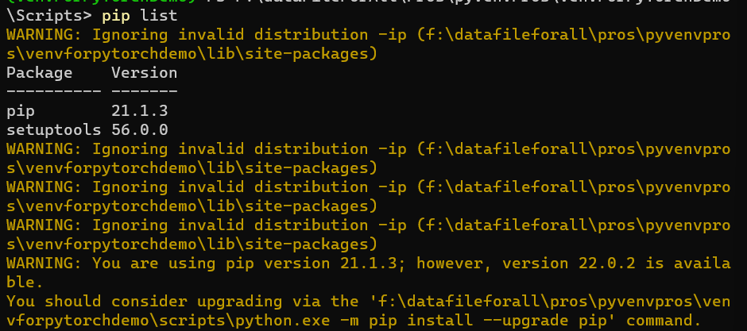
>
> 需要在包中手动删除这些带~波浪号的文件
>
> 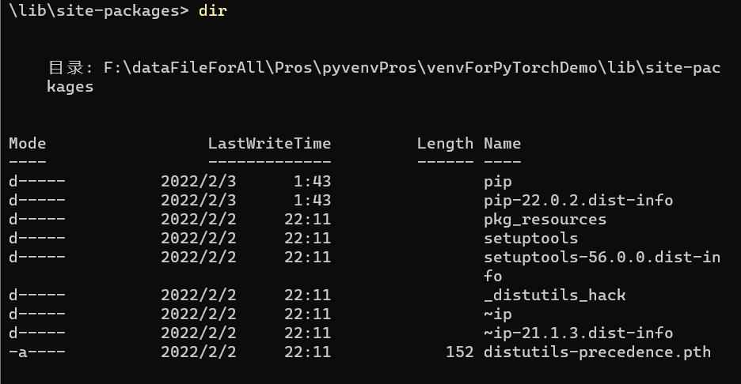
>
> 现在正常了
>
> 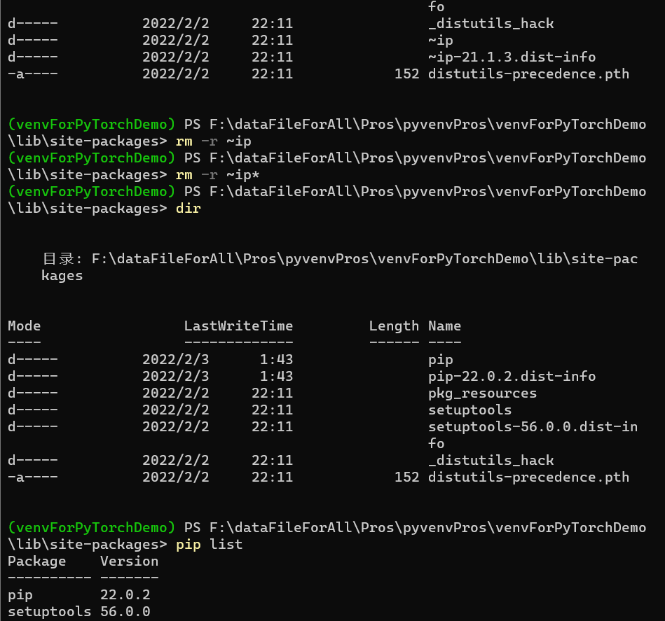

3. 打包

> 输入`pip -h`获得帮助，可以看到能通过freeze命令将环境中的所有包输出
>
> 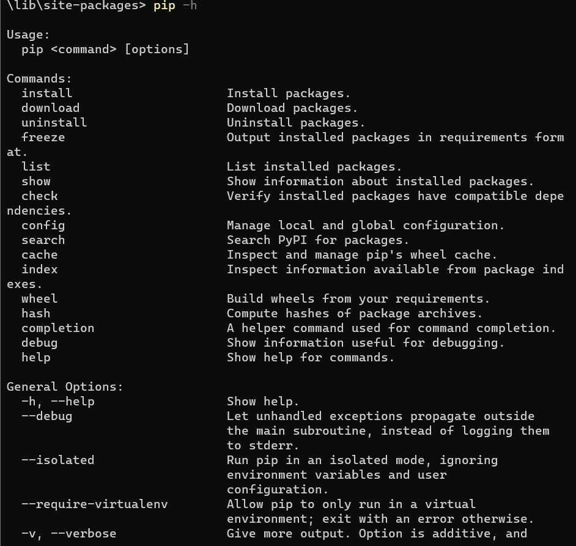
>
> `pip freeze > requirements.txt`
>
> 先查看环境中已安装的包：
>
> 
>
> 再用pip freeze来将包信息存入requirements.txt（这个命名是惯例，其实也可以用其他命名），其内容如图红色矩形部分:
> 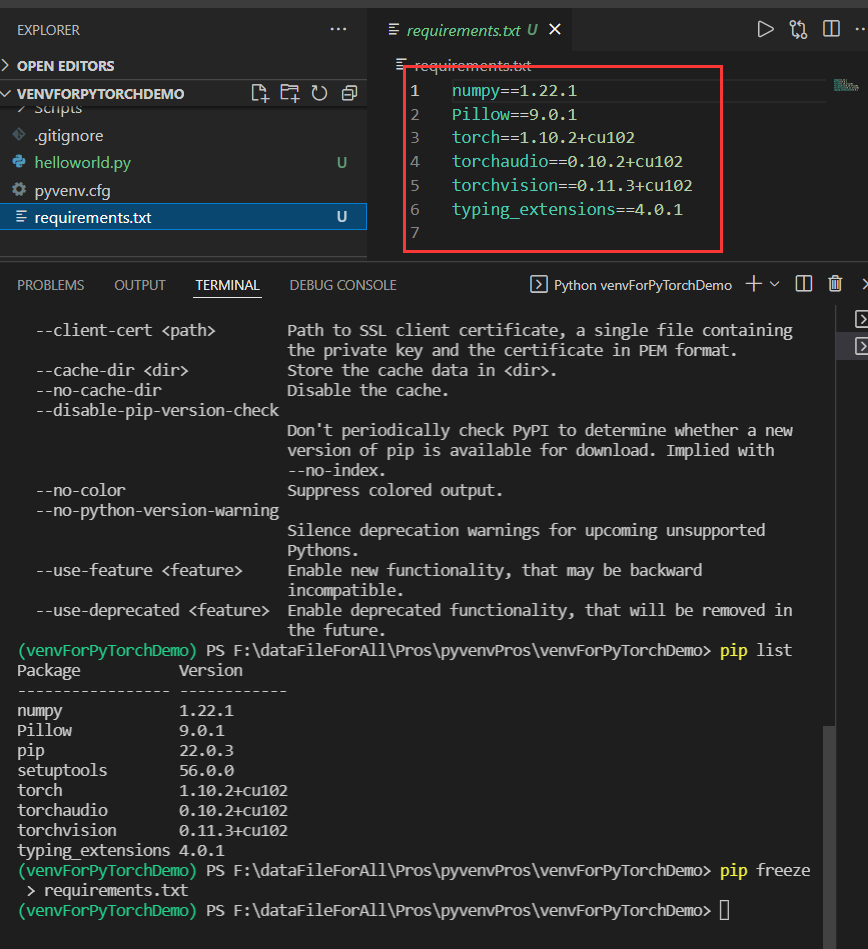
>
> 如果要在另一个python环境中获得所有requirements中列出的包，只需要用命令：
>
> `pip install -r requirements.txt`
>
> 就会用pip命令依次下载requirements.txt中列出的所有包
>
> 当然，缺点明显，freeze是将环境中的所有包列出，有一些包可能并没有被使用过
>
> > 另一种生成requirements.txt的方法是用pipreqs包，它通过import语句来寻找所有使用过的包
> >
> > 得先安装pipreqs包：
> >
> > `pip install pipreqs`
> >
> > 使用方法：
> >
> > [pipreqs使用笔记 - 知乎 (zhihu.com)](https://zhuanlan.zhihu.com/p/385402838)

4. 在vscode中查看和管理虚拟环境

>**前提**：vscode已经安装了Python Extension Pack插件
>
>完成上述步骤之后，我希望在vscode中使用插件管理多个环境，但是我发现我创建的环境venv在这里没有出现在插件的界面中（global是指全局环境，system是安装的msys2提供的虚拟操作系统环境，能用来搭载linux工具，简单理解可以当成一个小型linux操作系统，这个系统中还自带了一个python环境，vscode的环境管理插件也就将其当作了一个python环境，环境类型为System）
>
>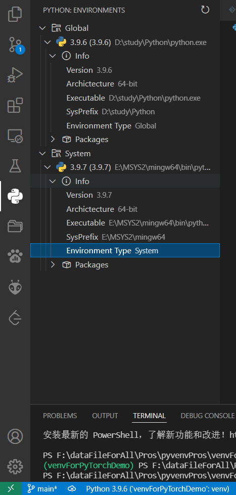
>
>这时候如果希望使用除了上图之外你自建的python虚拟环境中的解释器，你需要在上图最下方蓝色条部分点击“python”字样，手动选择输入解释器路径：
>
>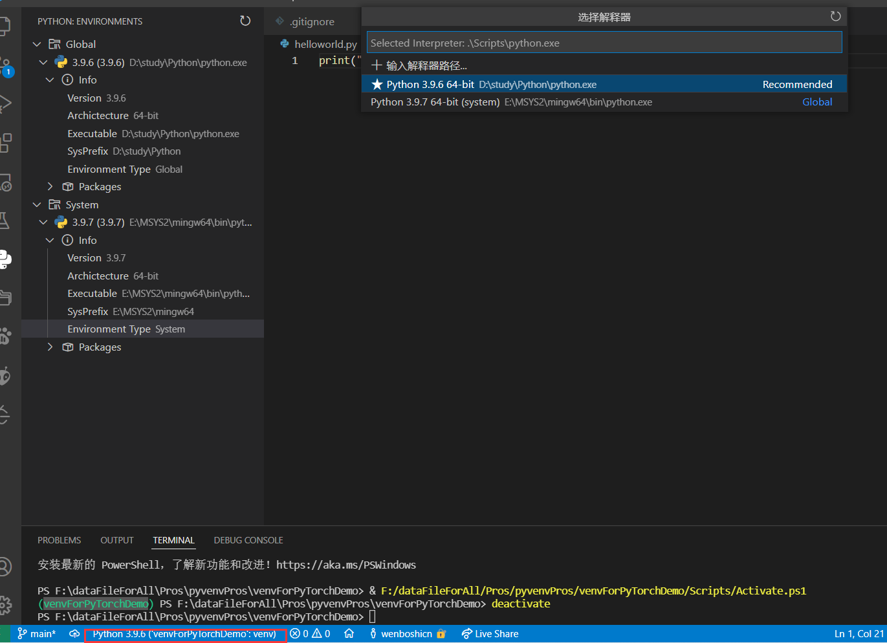
>
>我选好了路径，虽然下方显示出了python虚拟环境名，但是仍然不能通过python插件找到venvForPyTorchDemo环境的相关信息
>
>我找到了这个插件的信息页希望找到使用说明，vscode中的可视化包管理就是通过这个插件实现的，它的信息十分简短，没有我要的信息
>
>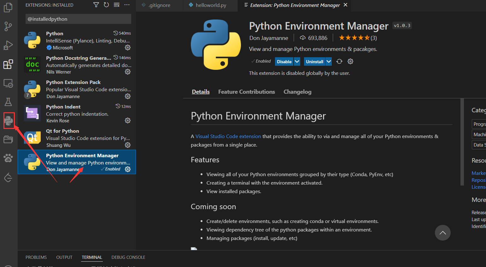
>
>但是注意这里：
>
>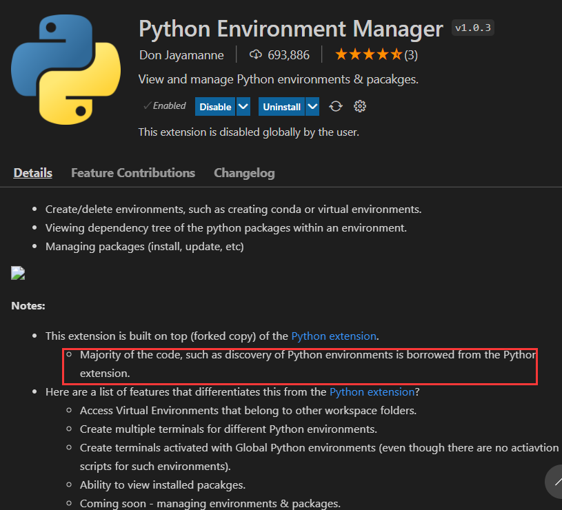
>
>上图表示python环境的发现是借用python extension的，因此前往python extension寻找信息（microsoft出的插件，文档确实相当完善，完全可以最为教程使用）：
>
>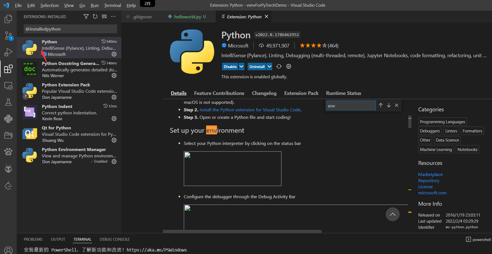
>
>图片显示不出来，可能是网络问题，直接点击插件名进入网站查看：
>
>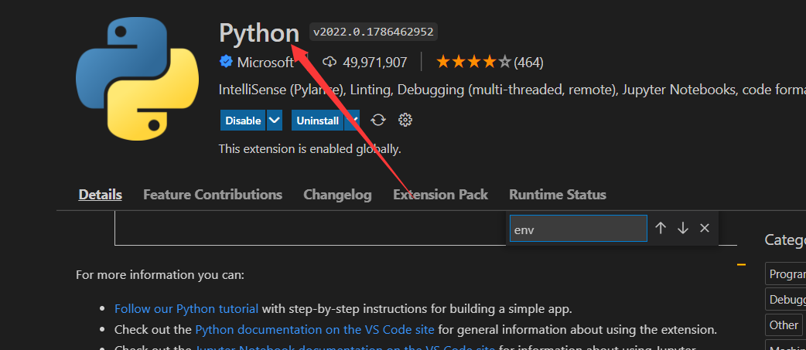
>
>[Using Python Environments in Visual Studio Code](https://code.visualstudio.com/docs/python/environments)
>
>一篇解决环境配置，也提供了虚拟环境相关内容的教学
>
>在venvForPyTorchDemo中是能够找到解释器的，但是无法自动添加到可视化插件中查看，查阅上面网址的文档发现以venvForPyTorchDemo的更上一层目录为workspace（vscode打开的目录称为工作区）时通过下面方式添加解释器路径，插件就能正常显示了：
>
>> 1.按ctrl+shift+p调出vscode命令，显示如下，输入select interpreter后选择图示命令：
>>
>> 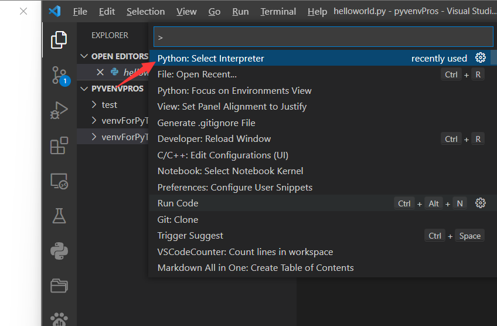
>>
>> 2.点这个加号
>>
>> 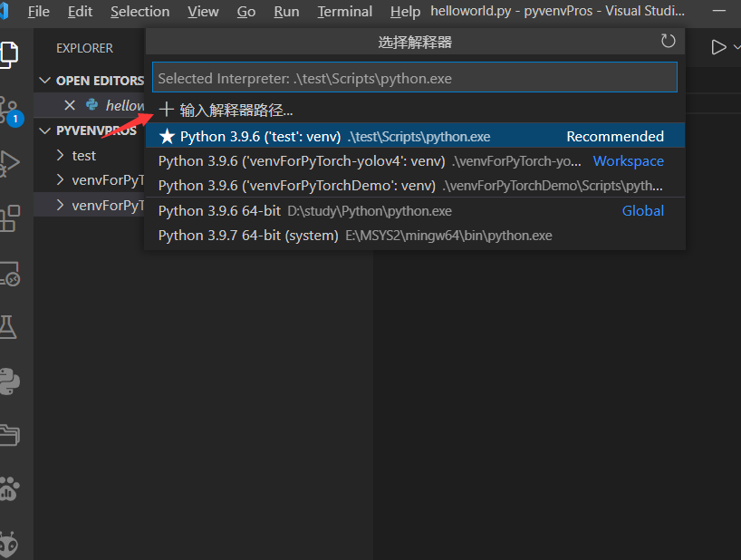
>>
>> 3.添加解释器路径
>>
>> 
>>
>> 4.然后查看插件，刷新一下，就会看到出现了一个新的Venv的图标，并且其子项出现了venvForTorchDemo
>>
>> 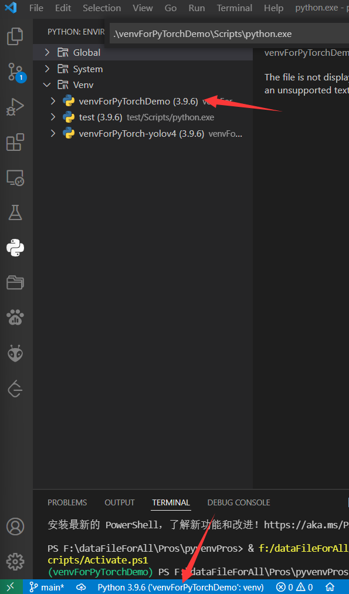

```powershell
python -m venv myvenv
```

## 其他问题及解决

- 环境中使用pip报错

```
Fatal error in launcher: Unable to create process using '"E:\github\Automatic Scheduling for Student Organization in YNU_C\ASSOY\Scripts\python.exe"  "E:\github\Automatic_Scheduling_for_Student_Organization_in_YNU_C\ASSOY\Scripts\pip.exe" list': ???????????    
```

用`python -m pip install --upgrade pip`重装pip，仍会带来其他问题（会导致该环境中lib中的pip中添加许多文件）

- 全局的多python版本管理（未能实现，出现了环境变量相互覆盖的问题，可使用完全路径解决）

- vscode中找不到包

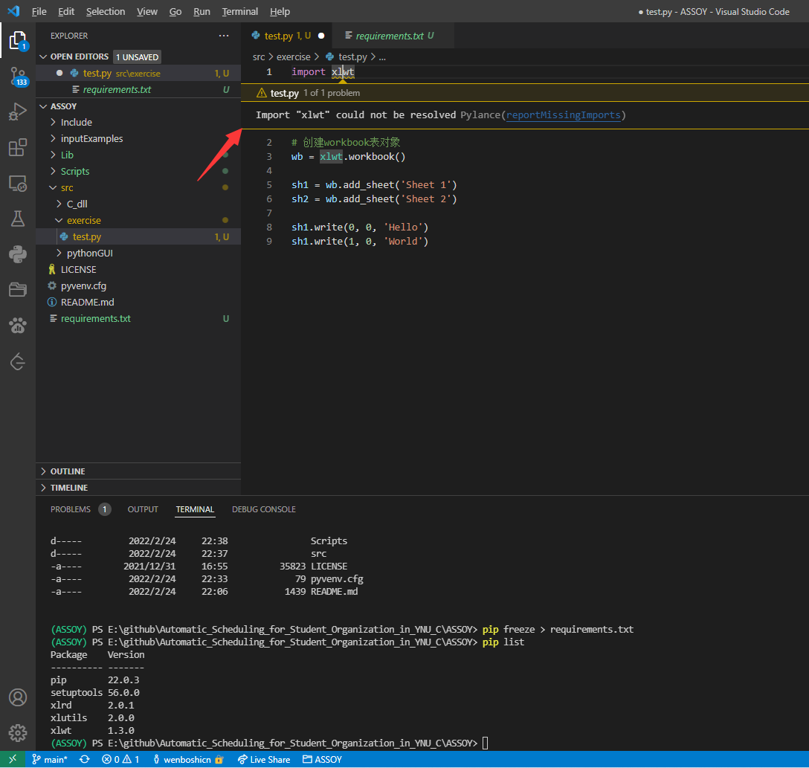

因为下方蓝条处没选择当前环境，选择当前环境时建议输入.\Scripts\python.exe路径，如果用绝对路径可能会导致python插件将其识别为system类型的虚拟环境
